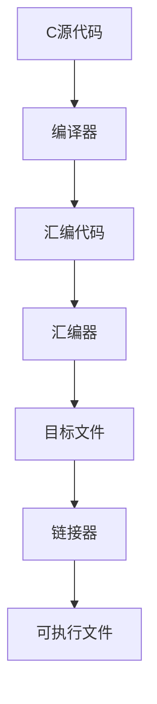

# Machine-Level Programming 1

## 1. 基本概念
### 机器代码 vs 汇编代码
- **机器代码**：处理器直接执行的二进制指令
- **汇编代码**：机器代码的文本表示形式（助记符形式）
- **中间代码**：编译器在优化过程中生成的中间表示（如LLVM IR）

### 学习环境
- **Intel x86-64**：Intel 64位指令集架构（x86的64位扩展）
- **CISC架构特点**：
  - 复杂指令集（约3000条指令）
  - 变长指令格式（1-15字节）
  - 内存操作数可直接参与运算
  - 实际Linux程序中只使用核心子集

## 2. Intel x86处理器发展
### 历史型号
- 8086 (1978, 16位) → 80286 → 80386 (32位) → x86-64 (2000)
- **CISC** (Complex Instruction Set Computer) vs **RISC** (Reduced Instruction Set Computer)
- 共同点都有86，所以x86

### 现代发展
| 架构特性 | x86 (CISC)        | ARM (RISC)       |
|----------|-------------------|------------------|
| 指令长度 | 变长 (1-15字节)   | 定长 (4字节)     |
| 寄存器数 | 16通用寄存器      | 31通用寄存器     |
| 功耗效率 | 较高功耗          | 低功耗设计       |
| 应用场景 | 服务器/桌面       | 移动/嵌入式      |

## 3. 程序执行视角
### 关键组件


#### 程序计数器 (PC/RIP)
- PC: Program Counter
- 存放下一条指令地址的64位寄存器
- 32位模式下称为EIP

#### 寄存器文件
- 16个64位通用寄存器：
    
**寄存器扩展历史**：
  - 8086：16位寄存器（AX, BX等）
  - 80386：扩展为32位（EAX, EBX等）
  - x86-64：扩展为64位（RAX, RBX等）
  - 可通过不同名称访问部分寄存器（如EAX访问RAX的低32位）

#### 内存与缓存
- **内存模型**：连续的字节数组（地址空间）
- **缓存**：透明的高速内存缓存（L1/L2/L3 Cache）
- **内存访问**：通过地址模式表达式访问

## 4. 编译过程
### 完整流程


### 关键步骤
1. **编译阶段**：`gcc -Og -S sum.c`
   - `-Og`：基本优化（适合调试）
   - 生成`.s`汇编文件

2. **汇编阶段**：`gcc -c sum.s`
   - 生成`.o`目标文件

3. **反汇编工具**：
   ```bash
   objdump -d sum.o  # 反汇编目标文件
   gdb ./sum         # 使用调试器查看
   ```

## 5. 汇编基础

### 数据移动指令
#### 操作数类型
| 类型   | 语法示例     | 说明         | name      |
| ---- | -------- | ---------- | --------- |
| 立即数  | `$0x4`   | 常量值        | Immediate |
| 寄存器  | `%rax`   | 寄存器内容      | Register  |
| 内存引用 | `(%rax)` | 寄存器值作为内存地址 | Memory    |

#### 数据移动模式
| 源操作数 | 目标操作数 | 示例                   | 等效C代码      |
|----------|------------|------------------------|---------------|
| 立即数   | 寄存器     | `movq $0x4, %rax`      | temp = 0x4;   |
| 立即数   | 内存       | `movq $-147, (%rax)`   | *p = -147;    |
| 寄存器   | 寄存器     | `movq %rax, %rdx`      | temp2 = temp1 |
| 寄存器   | 内存       | `movq %rax, (%rdx)`    | *p = temp;    |
| 内存     | 寄存器     | `movq (%rax), %rdx`    | temp = *p;    |
- 带括号的寄存器，代表的是一个地址，把这个地址当作内存去访问——寻址
**注意**：x86架构**不允许**内存到内存的直接传输，必须通过寄存器中转

### 内存寻址模式
#### 通用公式
`D(Rb, Ri, S)` → 有效地址 = `Rb + Ri*S + D`

- **D**：位移量（1/2/4字节）
- **Rb**：基址寄存器（任意通用寄存器）
- **Ri**：变址寄存器（除%rsp外的通用寄存器）
- **S**：比例因子（1/2/4/8）

**比例因子作用**：用于数组访问时元素大小的缩放，例如：
- int数组（4字节元素）：S=4
- long数组（8字节元素）：S=8

### 特殊指令 leaq
`leaq Src, Dst`
- **作用**：计算地址但不进行内存访问
- **典型应用**：
  1. 高效计算线性地址
  2. 实现复杂算术运算

#### 示例分析
```c
long m12(long x) {
    return x * 12;
}
```

汇编实现：
```assembly
leaq (%rdi, %rdi, 2), %rax   # rax = x + x*2 = 3x
salq $2, %rax                # rax = 3x << 2 = 12x
```

分步解释：
4. `leaq` 计算 `x + x*2`（利用比例因子2）
5. 左移2位实现乘以4操作

### 算术运算指令
#### 双操作数指令
| 指令   | 效果              | 等效C运算        |
|--------|-------------------|-----------------|
| addq S, D | D = D + S       | D += S          |
| subq S, D | D = D - S       | D -= S          |
| imulq S, D | D = D * S      | D *= S          |
| salq S, D | D = D << S     | D <<= S         |
| sarq S, D | D = D >> S（算术右移） | D >>= S（符号扩展） |
| shrq S, D | D = D >> S（逻辑右移） | D >>= S（零扩展） |

#### 单操作数指令
| 指令   | 效果              | 等效C运算    |
|--------|-------------------|-------------|
| incq D | D = D + 1         | D++         |
| decq D | D = D - 1         | D--         |
| negq D | D = -D            | D = -D      |
| notq D | D = ~D            | D = ~D      |

## 6. 关键概念详解
### 条件码寄存器
| 标志位 | 名称             | 设置条件                     |
|--------|------------------|----------------------------|
| CF     | Carry Flag       | 无符号溢出时置1             |
| ZF     | Zero Flag        | 结果为0时置1                |
| SF     | Sign Flag        | 结果为负时置1               |
| OF     | Overflow Flag    | 有符号溢出时置1             |

**注意**：算术运算指令会隐式设置条件码，用于后续条件跳转

### 寄存器访问细节
- **历史兼容性**：
  - 16位模式：AX, BX等16位寄存器
  - 32位模式：EAX（扩展AX），可单独访问低16位
  - 64位模式：RAX，可访问EAX（低32位）、AX（低16位）、AL（低8位）

### 缓存机制
- **多级缓存**：
  ```
  L1 Cache (32KB) → L2 Cache (256KB) → L3 Cache (8MB) → 主内存
  ```
- **访问速度**：L1访问约4 cycles，主内存访问约200+ cycles
- **透明性**：由硬件自动管理，程序员不可直接操作